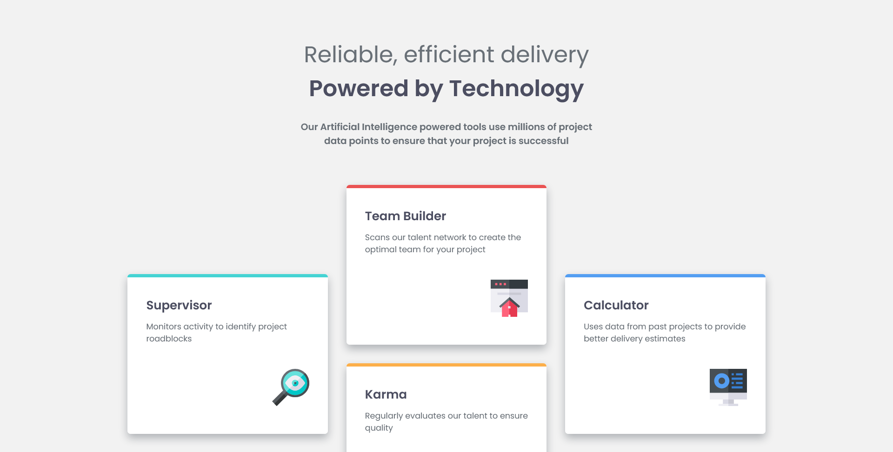

# Frontend Mentor - Four card feature section solution

This is a solution to the [Four card feature section challenge on Frontend Mentor](https://www.frontendmentor.io/challenges/four-card-feature-section-weK1eFYK). Frontend Mentor challenges help you improve your coding skills by building realistic projects.

## Table of contents

- [Overview](#overview)
  - [The challenge](#the-challenge)
  - [Screenshot](#screenshot)
  - [Links](#links)
- [My process](#my-process)
  - [Built with](#built-with)
  - [What I learned](#what-i-learned)
- [Author](#author)
- [Acknowledgments](#acknowledgments)

## Overview

### The challenge

I think this is my 6th project. I feel like I'm much faster than I used to finish project.
I learned about grid and flexbox. I used both of them in this project. I'm not used to using gird alot. For this project, I started using grid and I love it.
I take times (research) to get used to it.

### Screenshot



### Links

- Solution URL: [Solution URL here](https://github.com/MgMyatHtayKhant/four-card-feature-section-master)
- Live Site URL: [Live site URL here](https://four-card-main.netlify.app/)

## My process

### Built with

- Semantic HTML5 markup
- CSS custom properties
- Flexbox
- CSS Grid

### What I learned

I learned about how to use grid properly.

```css
.cards {
  max-width: 1097px;
  margin: 0 auto;
  display: grid;
  grid-template-columns: minmax(min-content, 600px);
  justify-content: center;
  gap: 2rem;
}

@media only screen and (min-width: 1000px) {
  html {
    font-size: 16px;
  }

  .cards {
    grid-template-columns: repeat(3, 1fr);
    grid-template-rows: auto auto;
    align-items: center;
  }

  .card:first-child {
    grid-area: 1 / 1 / 3 / 2;
  }

  .card:nth-child(2) {
    grid-area: 1 / 2 / 2 / 3;
  }

  .card:nth-child(3) {
    grid-area: 2 / 2 / 3 / 3;
  }

  .card:last-child {
    grid-area: 1 / 3 / 3 / 4;
  }
}
```

## Author

- Website - [Saul](https://saul-homepage.netlify.app/)
- Frontend Mentor - [@Saul](https://www.frontendmentor.io/profile/MgMyatHtayKhant)

## Acknowledgments

Everything was smooth until I faced how to center first and last cards vertically. I was struggling how to center them. At the end I asked Gemini AI for help.
